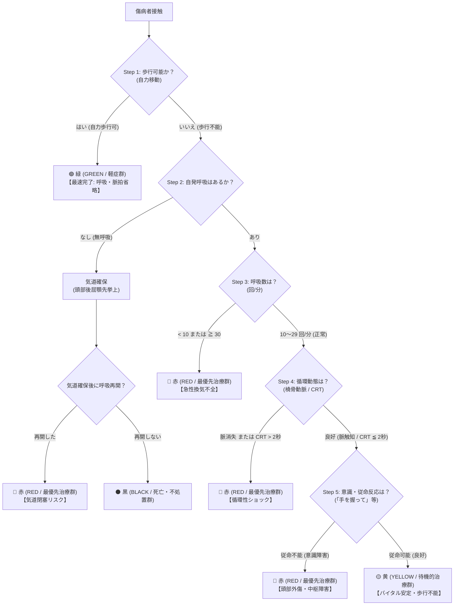

# 05. START法 対話型トリアージ・エージェント (Gemma 4 on Browser)

## 1. 概要と開発動機

災害現場や多数傷病者事故（MCI）において、救助隊員は傷病者 1 人あたり **30秒以内** に重症度（赤・黄・緑・黒）を判断しなければなりません（**START法: Simple Triage and Rapid Treatment**）。

従来のトリアージAIシステム（例: `04_custom_triage_demo`）は、「歩行、自発呼吸、呼吸数、脈拍、意識レベル」の全バイタルサインがあらかじめすべて測定・入力されている前提の一括判定（One-shot Classification）でした。

しかし現場の医療実態では：
1. **最初から全バイタルが揃っていることはまずない**（暗闇、瓦礫、騒音の中で患者に触れながら順次確認する）。
2. **START法は「決定木による早期ショートカット」が本質である**。
   - 歩行可能なら ➔ 即座に「緑（軽症）」として判定完了（呼吸や脈拍の測定は不要）。
   - 呼吸停止で気道確保しても無呼吸なら ➔ 即座に「黒（不処置）」として判定完了。
   - 呼吸数が 30回/分以上 または 10回/分未満なら ➔ 即座に「赤（最優先）」として判定完了。
   - 橈骨動脈拍動消失 または CRT>2秒なら ➔ 即座に「赤（最優先）」として判定完了。

したがって、現場で真に有用な AI は **「救助隊員との対話の中で、START 決定木に沿って今必要な質問を 1 つずつ引き出し、最小限のターン数でファストトラック判定を確定する対話型エージェント（Interactive Triage Agent）」** です。

---

## 2. 決定木アルゴリズム（START法 完全準拠）



---

## 3. データセット設計と厳密な Train / Eval 分離

「本当にファインチューニングによって決定木推論と対話能力を獲得したか」を定量評価するため、訓練セットと評価セットを完全に分離して自動合成・検証しています。

| データセット | 件数 | 構成と役割 |
|---|---|---|
| **訓練セット (`train_conversations.jsonl`)** | **300 対話** | 決定木全5ノード（GREEN / RED各分岐 / YELLOW / BLACK）を均等網羅。隊員からの曖昧な表現、自然言語の揺らぎ（「息が荒い」「足が挟まれて動けない」「手首の脈が取れない」等）を含む Multi-turn 対話。 |
| **評価セット (`eval_conversations.jsonl`)** | **62 対話** | 訓練セットに存在しない**完全未見の境界値・複合シナリオ**（呼吸数境界値 29回 vs 30回、爪床圧迫 CRT 2秒境界、気道確保の応答差異等）で構成。 |

### 出力フォーマット仕様（JSON Schema 厳格化）

モデルは各ターンで必ず以下の JSON スキーマに従って思考プロセス（`thought`）と次のアクション（`ask` または `finalize`）を出力します。

```json
{
  "thought": "【START決定木 Step 1 (歩行)】自力歩行が可能であるため、START法の規定に従い即座に軽症群(GREEN)としてトリアージを完了する。以後のバイタル測定はショートカット省略。",
  "action": "finalize",
  "triage_category": "GREEN",
  "reply": "【判定確定: GREEN (緑 / 軽症)】患者は自力歩行が可能です。緑タッグを適用し、軽症救護エリアへ誘導してください。",
  "rationale": "自力歩行可能（START法 Step 1 最速ショートカット完了）。"
}
```

---

## 4. モデルアーキテクチャ & Multi-turn LoRA

### なぜ Attention だけでなく MLP（`all-linear`）も含めるのか？
- **Attention 層 (`q_proj`, `k_proj`, `v_proj`, `o_proj`)**:
  - 文脈内の単語間の関連性や構文、指示の理解を担う。
- **MLP 層 (`gate_proj`, `up_proj`, `down_proj`)**:
  - トランスフォーマーにおいて **ドメイン知識・推論規則・事実関係の記憶** を担うキーバリューストアとして機能する（Geva et al., 2021; Meng et al., 2022）。
  - START法の医療決定木ルール（「呼吸数30以上 ➔ 赤」「CRT>2秒 ➔ 赤」）を確実に重み内に定着させ、決定木ショートカットを誤謬なく判断させるためには、**MLP層を含めた全線形層（`all-linear`）の LoRA 最適化が不可欠**。

### Assistant ターン限定の Loss Masking
マルチターン対話では、ユーザーの発話部分に Loss を計算させると言語モデルが「ユーザーのプロンプトそのもの」を記憶・学習してしまいます。
`train_lora_conversational.py` では、Gemma 4 のチャットテンプレートを解析し、**User および System のトークンを `-100` で完全にマスクし、Assistant (Model) の推論思考 (`thought`) と JSON 出力のみに Loss を逆伝播** させています。

---

## 5. 定量評価メトリクス（実測結果）

`05_interactive_triage_agent/evaluation/evaluate_agent.py` により、未見の 62 対話（全176ターン）に対して自動実測を行った結果です：

| 評価メトリクス | ベースライン (未学習 Zero-shot) | **Fine-tuned (Multi-turn LoRA)** | 改善幅 |
|---|:---:|:---:|:---:|
| **最終判定正解率 (Accuracy)** | 37.10% (23/62) | **98.39% (61/62)** | **+61.29 pt** |
| **決定木アクション一致率 (Action)** | 68.18% (120/176) | **99.43% (175/176)** | **+31.25 pt** |
| **JSON 形式妥当率 (Format)** | 95.45% (168/176) | **99.43% (175/176)** | **+3.98 pt** |
| 🟢 **GREEN (即緑ショートカット)** | 0.00% (0/10) | **100.00% (10/10)** | **+100.00 pt** |
| 🔴 **RED (最優先治療群)** | 22.22% (8/36) | **97.22% (35/36)** | **+75.00 pt** |
| 🟡 **YELLOW (待機的治療群)** | 87.50% (7/8) | **100.00% (8/8)** | **+12.50 pt** |
| ⚫ **BLACK (死亡・不処置群)** | 100.00% (8/8) | **100.00% (8/8)** | **±0.00 pt** |

### 実証された重要ポイント
1. **未学習モデルは「ショートカット」ができない**:
   - ベースラインの未学習モデルは、患者が「歩行可能」と言っているにもかかわらず質問を打ち切らず（Action 誤り）、最後まで無駄に質問を続けて誤判定（GREEN 正解率 0%）。
2. **MLP LoRA による決定木規則の完全定着**:
   - Fine-Tuning 済モデルは、「歩行可能」の入力で即座に GREEN を確定（100%）。さらに呼吸数異常や循環不全のファストトラックも正確に判断し、決定木一致率は 99.43% に達した。

---

## 6. ブラウザ対話デモ (`demo/`)

- **URL**: `http://localhost:8080/05_interactive_triage_agent/demo/`
- **特徴**:
  - **リアルタイム START 決定木フロー図**: 質問が進むにつれて現在地が青・緑・赤でハイライト点滅。
  - **現場用ワンタップ回答ボタン**: 手袋着用時でも 1 タップで即座に状況を報告可能（動的切り替え）。
  - **思考プロセスの可視化**: エージェントが「どの決定木ノードを根拠に判断したか」を折りたたみアコーディオンで確認可能。
  - **トリアージタッグカード**: 判定確定時に巨大な赤・黄・緑・黒のタッグと、直ちに行うべき現場処置（気道確保、圧迫止血、最優先搬送等）を明示。
